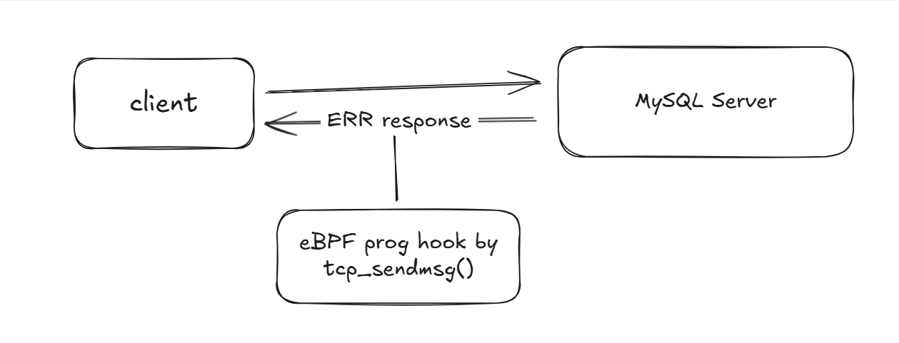

# mysql-error-echo

Short: Trace MySQL error responses at the kernel level - powered by eBPF.

MySQL Echo eBPF is an eBPF-powered observability tool that traces and inspects MySQL server error responses directly from the kernel, without modifying or instrumenting client applications. It attaches a kprobe to tcp_sendmsg to capture packets sent from the MySQL server to clients and inspects them only for error responses.
Only error messages returned by MySQL are reported - successful (OK) responses are ignored

**Note: It only supports unencrypted MySQL traffic (when ssl-mode=DISABLE).**

## How It Works



## Usage

```bash
# mysql-error-echo -h
eBPF to help trace MySQL error responses at the kernel level

Usage:
  mysql-error-echo [command]

Available Commands:
  completion  Generate the autocompletion script for the specified shell
  help        Help about any command
  run         Run the MySQL error response tracing program

Flags:
  -h, --help      help for mysql-error-echo
  -v, --verbose   verbose output print

Use "mysql-error-echo [command] --help" for more information about a command.
```

For example, if you want to trace error responses from MySQL server (on port 3306) to clients
```bash
# mysql-error-echo run --port 3306
```
*Result*
```bash
{"time":"2025-10-21T15:29:56.123756458+07:00","level":"INFO","msg":"eBPF program loaded and attached to tcp_sendmsg"}
{"time":"2025-10-21T15:29:56.123881188+07:00","level":"INFO","msg":"Press Ctrl+C to exit..."}
{"time":"2025-10-21T15:36:30.705346351+07:00","level":"INFO","msg":"mysql response","saddr":"172.18.0.2:3306","daddr":"10.194.60.90:47198","size":55,"msg":"3\u0003\ufffd\ufffd\u0004#08S01Got an error reading communication packets"}
```
<details>
<summary><b>Can add -v (verbose to see full hexdump of response)</b></summary>

```bash
# mysql-error-echo run -v
{"time":"2025-10-21T15:35:36.208853655+07:00","level":"INFO","msg":"eBPF program loaded and attached to tcp_sendmsg"}
{"time":"2025-10-21T15:35:36.208873532+07:00","level":"INFO","msg":"Press Ctrl+C to exit..."}
172.18.0.2:3306 -> 10.194.60.90:47198: size=55
HEX DUMP:
00000000  33 00 00 03 ff 86 04 23  30 38 53 30 31 47 6f 74  |3......#08S01Got|
00000010  20 61 6e 20 65 72 72 6f  72 20 72 65 61 64 69 6e  | an error readin|
00000020  67 20 63 6f 6d 6d 75 6e  69 63 61 74 69 6f 6e 20  |g communication |
00000030  70 61 63 6b 65 74 73 00  00 00 00 00 00 00 00 00  |packets.........|
00000040  00 00 00 00 00 00 00 00  00 00 00 00 00 00 00 00  |................|
00000050  00 00 00 00 00 00 00 00  00 00 00 00 00 00 00 00  |................|
00000060  00 00 00 00 00 00 00 00  00 00 00 00 00 00 00 00  |................|
00000070  00 00 00 00 00 00 00 00  00 00 00 00 00 00 00 00  |................|
00000080  00 00 00 00 00 00 00 00  00 00 00 00 00 00 00 00  |................|
00000090  00 00 00 00 00 00 00 00  00 00 00 00 00 00 00 00  |................|
000000a0  00 00 00 00 00 00 00 00  00 00 00 00 00 00 00 00  |................|
000000b0  00 00 00 00 00 00 00 00  00 00 00 00 00 00 00 00  |................|
000000c0  00 00 00 00 00 00 00 00  00 00 00 00 00 00 00 00  |................|
000000d0  00 00 00 00 00 00 00 00  00 00 00 00 00 00 00 00  |................|
000000e0  00 00 00 00 00 00 00 00  00 00 00 00 00 00 00 00  |................|
000000f0  00 00 00 00 00 00 00 00  00 00 00 00 00 00 00 00  |................|
00000100  00 00 00 00 00 00 00 00  00 00 00 00 00 00 00 00  |................|
00000110  00 00 00 00 00 00 00 00  00 00 00 00 00 00 00 00  |................|
00000120  00 00 00 00 00 00 00 00  00 00 00 00 00 00 00 00  |................|
00000130  00 00 00 00 00 00 00 00  00 00 00 00 00 00 00 00  |................|
00000140  00 00 00 00 00 00 00 00  00 00 00 00 00 00 00 00  |................|
00000150  00 00 00 00 00 00 00 00  00 00 00 00 00 00 00 00  |................|
00000160  00 00 00 00 00 00 00 00  00 00 00 00 00 00 00 00  |................|
00000170  00 00 00 00 00 00 00 00  00 00 00 00 00 00 00 00  |................|
00000180  00 00 00 00 00 00 00 00  00 00 00 00 00 00 00 00  |................|
00000190  00 00 00 00 00 00 00 00  00 00 00 00 00 00 00 00  |................|
000001a0  00 00 00 00 00 00 00 00  00 00 00 00 00 00 00 00  |................|
000001b0  00 00 00 00 00 00 00 00  00 00 00 00 00 00 00 00  |................|
000001c0  00 00 00 00 00 00 00 00  00 00 00 00 00 00 00 00  |................|
000001d0  00 00 00 00 00 00 00 00  00 00 00 00 00 00 00 00  |................|
000001e0  00 00 00 00 00 00 00 00  00 00 00 00 00 00 00 00  |................|
000001f0  00 00 00 00 00 00 00 00  00 00 00 00 00 00 00 00  |................|


{"time":"2025-10-21T15:36:30.705346351+07:00","level":"INFO","msg":"msql response","saddr":"172.18.0.2:3306","daddr":"10.194.60.90:47198","size":55,"msg":"3\u0003\ufffd\ufffd\u0004#08S01Got an error reading communication packets"} # This is a response that has sent back to client/backend
```

</details>

## Build
Docker image
```bash
# make docker-build ARGS=mysql-error-echo:v1.0.0
```
## Deploy
This repo you can build as container and run it as Sidecar or DaemonSet
