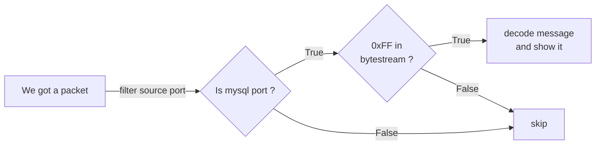

# mysql-error-echo

Observability tool that traces and inspects MySQL server error responses directly use **packet sniffing**, without modifying or instrumenting client applications. It capture packets sent from the MySQL server to clients and inspects them on-the-fly only for error responses.
From there, we can see all of error responses in just one place, that is very helpful if we have too many backends/clients are connecting to server.

**Note: It only supports unencrypted MySQL traffic (when ssl-mode=DISABLE).**

## How It Works

### Logical architecture diagram



## Usage

```bash
# ./mysql-error-echo -h
Usage of ./mysql-error-echo:
  -cache-duration duration
        Duration to keep DNS cache entries (example: 30s, 5m, 1h) (default 5m0s)
  -cache-size int
        Maximum number of entries to store in DNS cache (default 4096)
  -iface string
        Network interface to capture/process packets on (default "eth0")
  -nameserver string
        Custom DNS nameserver to use (example: 8.8.8.8:53). Leave empty to use system resolver
  -port int
        MySQL server port to trace (default 3306)
  -use-dns
        Resolve IP to domain (enable DNS reverse lookup)
```

For example, if you want to sniff error responses from MySQL server (on port 3306) at ens3 interface that are being sent back to clients.

```bash
# ./mysql-error-echo -iface ens3 -port 3306
{"time":"2025-11-17T11:33:05.547757911+07:00","level":"INFO","msg":"listening for MySQL error packets on","iface":"ens3","port":3306}
```


## Build
Require:
- Golang ver >= 1.25
To build to binary