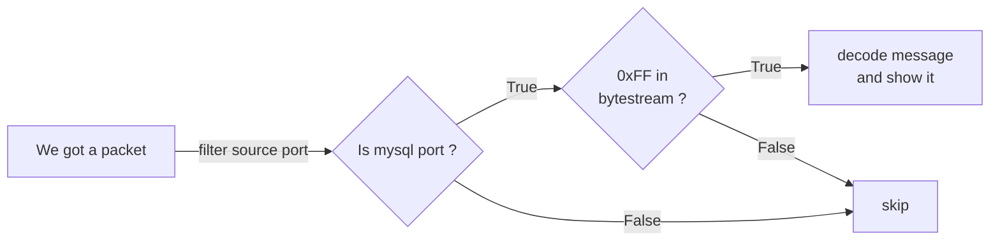

# sniff-mysql-error-response

Observability tool that traces and inspects MySQL server error responses directly use **packet sniffing**, without modifying or instrumenting client applications. It capture packets sent from the MySQL server to clients and inspects them on-the-fly only for error responses.
From there, we can see all of error responses in just one place, that is very helpful if we have too many backends/clients are connecting to server.

With container environment, this tool usually is deployed as sidecar container, that will deploy beside mysql container. See example at [mysql-deployment.yaml](../examples/mysql-deployment.yaml)

**This tool we can use to work with mysqlrouter/mysql/mariadb**

**Note: It only supports unencrypted MySQL traffic (when ssl-mode=DISABLE).**

## How It Works

### Logical architecture diagram



## Usage

```sh
./packet-sniffer mysql-error-response -h
Record error responses are sent to mysql-client and export it as Prometheus exporter base on libpcap

Usage:
  packet-sniffer mysql-error-response [flags]

Flags:
  -e, --exporter-port int   Prometheus exporter port (default 2112)
  -h, --help                help for mysql-error-response
  -i, --iface string        Network interface to monitor (default "eth0")
  -p, --port int            MySQL port to trace (default 3306)
  -v, --verbose             Enable verbose logging
```

For example, if you want to sniff error responses from MySQL server (on port 3306) at ens3 interface that are being sent back to clients.

```bash
# ./packet-sniffer -i ens3 -p 3306
{"time":"2025-11-17T11:33:05.547757911+07:00","level":"INFO","msg":"listening for MySQL error packets on","iface":"ens3","port":3306}
```

Example results:

```json
{"time":"2025-11-17T04:16:35.570455851Z","level":"INFO","msg":"MySQL ERR packet","src_ip":"10.199.230.0","src_port":6446,"dst_ip":"10.194.60.90","dst_port":35976,"length":64,"error_message":"\ufffd\u0014\u0004#42000Access denied for user 'router'@'%' to database 'mysql'"}
{"time":"2025-11-17T04:16:33.225500267Z","level":"INFO","msg":"MySQL ERR packet","src_ip":"10.199.230.0","src_port":6446,"dst_ip":"10.194.60.90","dst_port":34650,"length":123,"error_message":"\ufffd\u0015\u0004#28000Access denied for user 'root'@'domain.svc.cluster.local' (using password: YES)"}
{"time":"2025-11-17T08:05:13.98333153Z","level":"INFO","msg":"MySQL ERR packet","src_ip":"10.199.230.42","src_port":6446,"dst_ip":"10.199.230.1","dst_port":52540,"length":145,"error_message":"\ufffd\ufffd\u000f#HY000The client was disconnected by the server because of inactivity. See wait_timeout and interactive_timeout for configuring this behavior."}
```

## Metrics

[Metrics exporter](./metrics.md)
